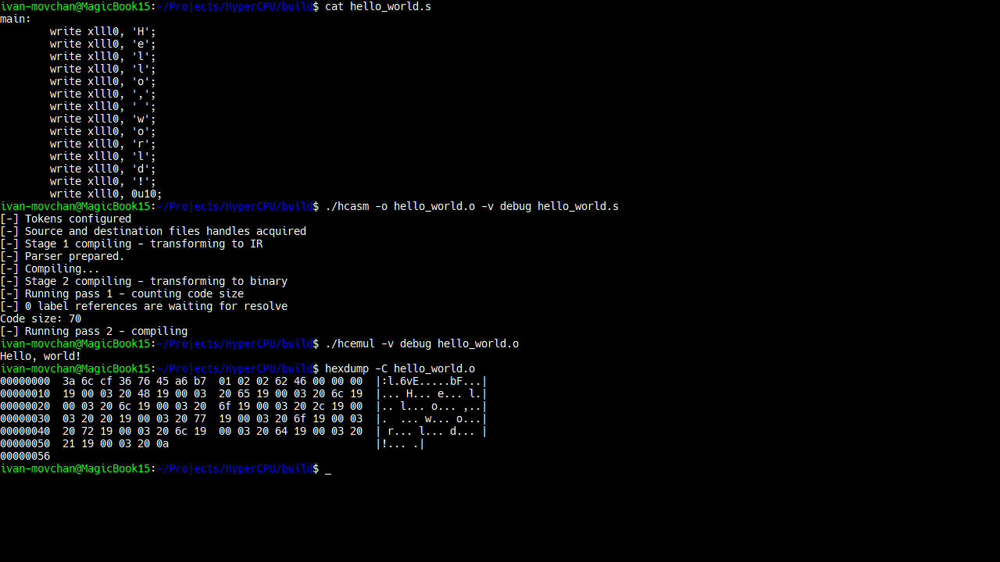

<div align="center">
     <picture>
          <source media="(prefers-color-scheme: dark)" srcset="images/logo_dark.png">
          <source media="(prefers-color-scheme: light)" srcset="images/logo.png">
          
     </picture>
</div>

<h4 align="center">HyperCPU - the <i>hyper</i> toolkit for custom <i>hyper</i> ISA</h4>

<p align="center">
     <a href="https://github.com/HyperWinX/HyperCPU/issues">
     </a>
     
     
     
     
     
</p>

>[!IMPORTANT]
> HyperCPU is almost ready for use! Wait for 1.0 release to try it out or build the project yourself, test and report found issues.



HyperCPU is a set of programs created to work with my own simple ISA (instruction set architecture). The project was created for fun, but it took a lot of time (and nerves) and I learned a lot while working on it.

HyperCPU project includes:
* **hCPU emulator**;
* **hASM assembler**;
* ~~**hASM disassembler**~~ (in development).

The project roadmap can be found [here](ROADMAP.md).

### Installation

>[!WARNING]
> HyperCPU supports 64-bit GNU/Linux systems only.

#### Dependencies

* `gcc >= 14` or `clang >= 19`;
* `cmake >= 3.28`;
* `make`;
* `ninja`;
* `re2`;
* `libfmt`;
* `googletest` (required for building tests in Release profile);
* `python3`, `python3-pip`, `python3-sphinx`, `python3-sphinx-rtd-theme` (required for building a documentation).

#### Build instructions

```bash
$ git clone https://github.com/HyperWinX/HyperCPU --recursive
$ cd HyperCPU
$ cmake -S. -Bbuild -G "Ninja" -DCMAKE_BUILD_TYPE=Release
$ ninja -C build default -j$(nproc)
$ cd docs
$ make html
```

`cmake` build options:
* `CMAKE_BUILD_TYPE:STRING` - project build profile (`Release` or `Debug`), mandatory to be specified;
* `HCPU_SANITIZERS_ENABLED:BOOL` - HyperCPU sanitizers, enabled by default (use `-DHCPU_SANITIZERS_ENABLED:BOOL=OFF` to disable).

The compiled binaries should be located in `build` directory. The generated documentation should be located in `docs/_build/html` directory. Open `index.html` and start reading.

### Usage

#### `hcasm` (hASM assembler)

To compile a program to a binary file:

```bash
$ ./hcasm -o <target> <source>
```

To compile a program to an object file:

```bash
$ ./hcasm -c <target> <source>
```

To do things with a different verbosity level (`warning` by default):

```bash
$ ./hcasm -v [debug | info | warning | error] ...
```

To display a help message and exit:

```bash
$ ./hcasm -h # = ./hcasm --help
```

To display a version and exit:

```bash
$ ./hcasm --version
```

#### `hcemul` (hCPU emulator)

To run a binary:

```bash
$ ./hcasm <target>
```

To do things with a different verbosity level (`debug` by default):

```bash
$ ./hcemul -v [debug | info | warning | error] ...
```

To display a help message and exit:

```bash
$ ./hcemul -h # = ./hcemul --help
```

To display a version and exit:

```bash
$ ./hcemul --version
```

### Contributing

HyperCPU is in active development and we will be happy to hear any feedback from you. Do not hesitate to report bugs or suggest any ideas using "Issues" page.

>[!IMPORTANT]
>Please send your pull requests to `dev` repository branch (not `master`).

Thank you for your interest in HyperCPU.

### Authors

HyperCPU is brought to you by:

* [HyperWin](https://github.com/HyperWinX) (2024 - present time) - idea, code, documentation.
* [Ivan Movchan](https://github.com/ivan-movchan) (2025 - present time) - artwork, beta testing, code examples.

### License

HyperCPU is free software: you can redistribute it and/or modify it under the terms of the GNU General Public License as published by the Free Software Foundation, either version 3 of the License, or (at your option) any later version.

This program is distributed in the hope that it will be useful, but WITHOUT ANY WARRANTY; without even the implied warranty of MERCHANTABILITY or FITNESS FOR A PARTICULAR PURPOSE. See the GNU General Public License for more details.

You should have received a copy of the GNU General Public License
along with this program. If not, see <http://www.gnu.org/licenses/>.
